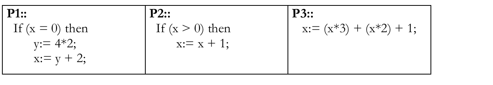

# Práctica 1

Creadas: 25 de agosto de 2025 16:12
Asignatura: Concurrente

## Tips mencionados en exp práctica

Cosas a tener en cuenta (mencionado en explicación práctica):

- sentencias await en distintas formas: exclusión mutua, sincronización por condición, o ambas juntas
- aprender a i identificar cuales son los procesos, cuales son los recursos compartidos usados por los procesos (representados por variables), cuando se necesita proceso coordinador/administrador, cuando son los propios procesos que administran el acceso a los propios recursos
- soluciones de grano fino: utilizar variables compartidas sin las sentencias await, trabajando con variables compartidas y técnica busy waiting (loopeandoo en un while hasta que una variable compartida modifica un valor) → es técnica ineficiente por que usa procesador sin avanzar, pero hasta este momento no tenemos mas opción.
    - analizar algoritmos para barreras y secciones criticas para resolver esto de grano fino

### 1)

Para el siguiente programa concurrente suponga que todas las variables están inicializadas en
0 antes de empezar. Indique cual/es de las siguientes opciones son verdaderas:
a) En algún caso el valor de x al terminar el programa es 56.
b) En algún caso el valor de x al terminar el programa es 22.
c) En algún caso el valor de x al terminar el programa es 23.



1. verdadero
P1: `y:=8; x:=10` → P2: `x:=11` → P3 lee `x=11` en ambas lecturas y hace `x:=3*11 + 2*11 + 1 = 56`.
2. verdadero
    
    P3: x:= 3*0 → P1: `y:=8; x:=10` →  P3: x:=10*2 + 1= 21 → P2: x:=21+1 = 22
    
3. verdadero
    
    P3: x:=3*0 → P1= x:=10 →P2: x=x+1= 11 → P3: x:=(11*2) +1 =23
    

### 2)

Realice una solución concurrente de grano grueso (utilizando <> y/o <await B; S>) para el
siguiente problema. Dado un número N verifique cuántas veces aparece ese número en un
arreglo de longitud M. Escriba las pre-condiciones que considere necesarias.

Las pre-condiciones a tener en cuenta son: 

- M es divisible por N
- el arreglo esta inicializado

```java
int total = 0;
int bloque = M / N; // tamaño de cada bloque 

Process verificar_aparicion[id:0..N-1]
{
    int parcial = 0;
    int inicio = id * bloque;
    int fin = inicio + bloque;

    for (int j = inicio; j < fin; j++) {
        if (array[j] == num)
            parcial++;
    }

    <total = total + parcial;>
}
```

### 3)

Dada la siguiente solución de grano grueso:

a) Indicar si el siguiente código funciona para resolver el problema de
Productor/Consumidor con un buffer de tamaño N. En caso de no funcionar, debe
hacer las modificaciones necesarias.


No funciona ya que un consumidor podria querer consumir un elemento que todavia no fue dejado en el buffer por el productor

```java
int cant = 0; int pri_vacia = 0; int pri_ocupada = 0; int buffer[N];
process productor {
    while (true){
        // producir elemento
        <await (cant < N); cant++;
        buffer[pri] = elemento;>
        pri_vacia = (pri_vacia + 1) mod N;
    }
}

process consumidor{ 
    while (true) { 
        <await (cant > 0); cant-- 
        elemento = buffer[pri];>
        pri_ocupada = (pri_ocupada + 1) mod N;
        //consume elemento
    }
}

```

b) Modificar el código para que funcione para C consumidores y P productores. 

Para este caso deberia estar todo dentro de la seccion critica, dado que sino cuando estoy actualizando el valor de pri_vacia y o pri_ocupada otro proceso podria estar actualizando a la ves y generar resultados incorrectos. 

```java
int cant = 0; int pri_vacia = 0; int pri_ocupada = 0; int buffer[N];
process productor {
    while (true){
        // producir elemento
        <await (cant < N); cant++;
        buffer[pri] = elemento;
        pri_vacia = (pri_vacia + 1) mod N; >
    }
}

process consumidor{ 
    while (true) { 
        <await (cant > 0); cant-- 
        elemento = buffer[pri];
        pri_ocupada = (pri_ocupada + 1) mod N; >
        //consume elemento
    }
}
```

### 4)

Resolver con SENTENCIAS AWAIT (<> y <await B; S>). Un sistema operativo mantiene
5 instancias de un recurso almacenadas en una cola, cuando un proceso necesita usar una
instancia del recurso la saca de la cola, la usa y cuando termina de usarla la vuelve a depositar.

```java
recursoEnCola rec[5]; cant=5;

process usoRecurso[id: 0..N-1]{
	Recurso r;
	<await (cant>0);
	r= rec.pop();
	cant--; >
	
	//uso del recurso
	
	//deposito nuevamente en la cola
	<rec.push(r)
	cant++;>
}

```

### 5)

En cada ítem debe realizar una solución concurrente de grano grueso (utilizando <> y/o
<await B; S>) para el siguiente problema, teniendo en cuenta las condiciones indicadas en el
item. Existen N personas que deben imprimir un trabajo cada una.

a) Implemente una solución suponiendo que existe una única impresora compartida por
todas las personas, y las mismas la deben usar de a una persona a la vez, sin importar el
orden. Existe una función Imprimir(documento) llamada por la persona que simula el uso
de la impresora. Sólo se deben usar los procesos que representan a las Personas.

```java
int personas;

process persona [id:0..personas-1]{
		Documento documento;
		< Imprimir(documento); >
 }
```

b) Modifique la solución de (a) para el caso en que se deba respetar el orden de llegada.

```java
int personas;
int siguiente=-1;
cola c;

process persona [id:0..personas-1]{
		Documento documento;
		<if(siguiente == -1){
				siguiente = id;
		}
		else{
			encolarPersona(i,c)
		}>
		<await (siguiente == id)>
		  
		  Imprimir(documento);
		  
		 <if (empty(C)) siguiente:=-1
     else siguiente = sacar(C)>;
		
 }
```

c) Modifique la solución de (a) para el caso en que se deba respetar el orden dado por el
identificador del proceso (cuando está libre la impresora, de los procesos que han
solicitado su uso la debe usar el que tenga menor identificador).

```java

ColaEspecialOrdenada C;
int siguiente=-1;

Process Persona[i:1..N]
  { <if (siguiente=-1) siguiente= i;
     else agregarOrdenado(C, i)>; 
    <await (siguiente==i)>;
    Imprimir(documento);
    <if (empty(C)) siguiente:=-1
     else siguiente = sacar(C)>;
  }

```

//en este caso el b es igual al c, pero tener cuidado con este tipo de ejercicios , no siempre es asi, hay veces que por ejemplo se requieren dos colas (por ejemplo una cola con prioridad y otra sin prioridad)

d) Modifique la solución de (b) para el caso en que además hay un proceso Coordinador que
le indica a cada persona que es su turno de usar la impresora.

```java
bool termine =false;
process Persona (i=0 .. m-1)
		Documento doc;
		<push(cola ,i)>
		<await (Siguiente == i);>
		Imprimir (doc)
		termine =true;
		
}

process Coordinador {
	while (true){
			<await (!empty(cola);>
			<Siguiente = pop(cola);
			termine = false;>
			<await (termine);>

}		
```

### 6)

Dada la siguiente solución para el Problema de la Sección Crítica entre dos procesos
(suponiendo que tanto SC como SNC son segmentos de código finitos, es decir que terminan
en algún momento), indicar si cumple con las 4 condiciones requeridas:


- Exclusión mutua: a lo sumo un proceso a la vez.  CUMPLE
- Ausencia de deadlock: si 2 o mas procesos que tratan entrar a su sección critica, al menos uno tendrá éxito. CUMPLE
- Ausencia de demora innecesaria: si un proceso trata de entrar y los otros procesos están en su SNC o terminaron, el primero no este impedido de entrar a su SC.
    - NO CUMPLE, si el proceso SC1 termina el proceso SC2 se puede ejecutar una vez, pero despues le pasa el turno a SC1 y como este termino, nunca le vuelve a pasar el turno a SC2
- Eventual entrada: un proceso que intenta entrar a su SC tiene posibilidades de hacerlo. CUMPLE

### 7)

Desarrolle una solución de grano fino usando sólo variables compartidas (no se puede usar
las sentencias await ni funciones especiales como TS o FA). En base a lo visto en la clase 3
de teoría, resuelva el problema de acceso a sección crítica usando un proceso coordinador.
En este caso, cuando un proceso SC[i] quiere entrar a su sección crítica le avisa al coordinador,
y espera a que éste le dé permiso. Al terminar de ejecutar su sección crítica, el proceso SC[i]
le avisa al coordinador. **Nota:** puede basarse en la solución para implementar barreras con
“Flags y coordinador” vista en la teoría 3.

```java

int arribo[1..n] = ([n]0);       // indica que el proceso quiere entrar
int continuar[1..n] = ([n]0);    // indica que el coordinador da permiso

process SC[i:1..n] {
    while (true) {
        arribo[i] = 1;               // aviso que quiero entrar
        while (continuar[i] == 0) skip; // espero permiso del coordinador
        // --- sección crítica ---
        arribo[i] = 0;               // aviso que terminé
    }
}

process Coordinador {
    while (true) {
        for i = 1 to n {
		        if (arribo[i]==1){
               
             continuar[i] = 1;              // doy permiso
             while (arribo[i] == 1) skip;   // espero que termine SC[i]
             continuar[i] = 0;              // reinicio permiso para próxima ronda
            }        
        }
    }
}

```