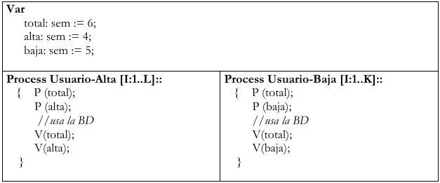

# Práctica 2

Resumen básico de explicación práctica:

- Los semáforos siempre inicializados
- Ejemplo:
    - sem e = 1;
    - Demorar hasta que algo ocurra P(e)
    - Avisar que algo ocurrio para que otro pueda continuar V(e)
- Si hay dos procesos queriendo hacer P, pasa cualquiera
- cuando hay barreras, en gral, primero liberar la seccion critica y despues dormirse en la barrera

### 1)

Existen N personas que deben ser chequeadas por un detector de metales antes de poder
ingresar al avión.
a. Analice el problema y defina qué procesos, recursos y semáforos serán
necesarios/convenientes, además de las posibles sincronizaciones requeridas para
resolver el problema.
b. Implemente una solución que modele el acceso de las personas a un detector (es decir,
si el detector está libre la persona lo puede utilizar; en caso contrario, debe esperar).
c. Modifique su solución para el caso que haya tres detectores.

b)

```java
sem e = 1;
Process Persona [id: 0..N-1]{
	P(e);
	//accede al detector de metales
	V(e);
}
```

c)

```java
sem e = 3;
Process Persona [id: 0..N-1]{
	P(e);
	//accede al detector de metales
	V(e);
}
```

### 2)

Un sistema de control cuenta con 4 procesos que realizan chequeos en forma
colaborativa. Para ello, reciben el historial de fallos del día anterior (por simplicidad, de
tamaño N). De cada fallo, se conoce su número de identificación (ID) y su nivel de
gravedad (0=bajo, 1=intermedio, 2=alto, 3=crítico). Resuelva considerando las siguientes
situaciones:
a) Se debe imprimir en pantalla los ID de todos los errores críticos (no importa el
orden).
b) Se debe calcular la cantidad de fallos por nivel de gravedad, debiendo quedar los
resultados en un vector global.
c) Ídem b) pero cada proceso debe ocuparse de contar los fallos de un nivel de
gravedad determinado.

a) Se debe imprimir en pantalla los ID de todos los errores críticos (no importa el
orden).

```java
HistorialFallos fallos[N];
int bloque = N / 4;
sem mutex = 1;

Process controlador (id:0..3) {
    int inicio = id * bloque;
    int fin = inicio + bloque;

    for (int j = inicio; j < fin; j++) {
        if (fallos[j].gravedad == 3) {
            P(mutex);
            print(fallos[j].ID);
            V(mutex);
        }
    }
}

```

b) Se debe calcular la cantidad de fallos por nivel de gravedad, debiendo quedar los
resultados en un vector global.

```java

HistorialFallos fallos[N];
int bloque = N / 4;
FallosPorNivel fallosNivel [4]= ([4]0);
sem espera[4]=([4]1);

Process controlador (id:0..3) {
    int inicio = id * bloque;
    int fin = inicio + bloque;

    for (int j = inicio; j < fin; j++) {
				   P(espera[fallos[j].gravedad]);
				   fallosNivel[fallos[j].gravedad]=fallosNivel[fallos[j].gravedad]+1;
				   V(espera[fallos[j].gravedad]);
     
        }
    }
}

```

c) Ídem b) pero cada proceso debe ocuparse de contar los fallos de un nivel de
gravedad determinado.

```java
HistorialFallos fallos[N];
FallosPorNivel fallosNivel [4]= ([4]0);

Process controlador (id:0..3) {

		for(i=0; i<N; i++){
				if(fallos[i].gravedad == id){
						fallosNivel[id]=fallosNivel[id]+1;
				}
		}
}
```

### 3)

Un sistema operativo mantiene 5 instancias de un recurso almacenadas en una cola.
Además, existen P procesos que necesitan usar una instancia del recurso. Para eso, deben
sacar la instancia de la cola antes de usarla. Una vez usada, la instancia debe ser encolada
nuevamente para su reúso.

```java
recursoSO cola;
sem recursos= 5;
sem mutex = 1;

Process usadorDeRecurso [id:0..P]{
		
		while(true){
			P(recursos); //para esperar a que haya recursos
			P(mutex);
			Recurso r = cola.pop();
			V(mutex);
			//usar recurso     
			P(mutex);
			cola.push(r);
			V(mutex);
			V(recursos)
		}
}
```

### 4)

1. Suponga que existe una BD que puede ser accedida por 6 usuarios como máximo al
mismo tiempo. Además, los usuarios se clasifican como usuarios de prioridad alta y
usuarios de prioridad baja. Por último, la BD tiene la siguiente restricción:
• no puede haber más de 4 usuarios con prioridad alta al mismo tiempo usando la BD.
• no puede haber más de 5 usuarios con prioridad baja al mismo tiempo usando la BD.
Indique si la solución presentada es la más adecuada. Justifique la respuesta.



No es adecuada por lo siguiente:

- podría ocurrir que pase por el primer P pq no hay 6 usuarios en la BD, pero como si hay 4 de prioridad alta no puede avanzar y le saca la posibilidad a uno de prioridad baja y viceversa. —>demora innecesaria
- la declaracion de las variables es incorrecta:
    - sem total = 6;
- la solucion seria:

```java

sem sem = 6;
sem alta = 4;
sem baja = 5;

Process Usuario-Alta [I:1..L]::  
{   
		P (alta); 
		P (total); 
		//usa la BD 
		V(total); 
		V(alta); 
} 

Process Usuario-Baja [I:1..K]::  
{    
		P (baja); 
		P (total); 
		//usa la BD 
		V(total); 
		V(baja); 
}
```

### 5)

Productor Consumidor

1. En una empresa de logística de paquetes existe una sala de contenedores donde se
preparan las entregas. Cada contenedor puede almacenar un paquete y la sala cuenta con
capacidad para N contenedores. Resuelva considerando las siguientes situaciones:
a) La empresa cuenta con 2 empleados: un empleado Preparador que se ocupa de
preparar los paquetes y dejarlos en los contenedores; un empelado Entregador
que se ocupa de tomar los paquetes de los contenedores y realizar la entregas.
Tanto el Preparador como el Entregador trabajan de a un paquete por vez.
b) Modifique la solución a) para el caso en que haya P empleados Preparadores.
c) Modifique la solución a) para el caso en que haya E empleados Entregadores.
d) Modifique la solución a) para el caso en que haya P empleados Preparadores y E
empleadores Entregadores.

1.   

```java

Contenedor contenedor[n];

sem vacio=n;
sem lleno=0;
int ocupado=0;
int libre=0;

process Preparador {
		while(true){			
			//produce un paquete
			P(vacio);
			contenedor[libre]=paquete; // deja el paquete
			V(lleno);
			libre = (libre + 1) mod n;
		}
}

process Entregador {
		while(true){		
			
			P(lleno);
			paquete = contenedor[ocupado];
			V(vacio);
			ocupado = (ocupado + 1) mod n;
			//entrega el paquete
		}
}
```

b) Modifique la solución a) para el caso en que haya P empleados Preparadores.

```java
		

Contenedor contenedor[n];

sem vacio=n;
sem lleno=0;
sem mutexP=1;
int ocupado=0;
int libre=0;

process Preparador (id:0..P) {
		while(true){			
			//produce un paquete
			P(vacio);
			P(mutexP); //para evitar que dos productores escriban la misma pos
			contenedor[libre]=paquete; // deja el paquete
			libre = (libre + 1) mod n;
			V(mutexP);
			V(lleno);
	
		}
}

process Entregador {
		while(true){		
			
			P(lleno);
			paquete = contenedor[ocupado];
			V(vacio);
			ocupado = (ocupado + 1) mod n;
			//entrega el paquete
		}
}
```

c) Modifique la solución a) para el caso en que haya E empleados Entregadores.

```java
Contenedor contenedor[n];

sem vacio=n;
sem lleno=0;
sem mutexE=1;
int ocupado=0;
int libre=0;

process Preparador  {
		while(true){			
			//produce un paquete
			P(vacio);
			contenedor[libre]=paquete; // deja el paquete
			V(lleno);
			libre = (libre + 1) mod n;
	
		}
}

process Entregador (id:0..P) {
		while(true){		
			
			P(lleno);
			P(mutexE);
			paquete = contenedor[ocupado];
			ocupado = (ocupado + 1) mod n;
			V(mutexE);
			V(vacio);
			//entrega el paquete
		}
}
```

d) Modifique la solución a) para el caso en que haya P empleados Preparadores y E
empleadores Entregadores.

```java
Contenedor contenedor[n];

sem vacio=n;
sem lleno=0;
sem mutexE=1;
sem mutexP=1;
int ocupado=0;
int libre=0;

process Preparador (id:0..P) {
		while(true){			
			//produce un paquete
			P(vacio);
			P(mutexP); //para evitar que dos productores escriban la misma pos
			contenedor[libre]=paquete; // deja el paquete
			libre = (libre + 1) mod n;
			V(mutexP);
			V(lleno);
	
		}
}

process Entregador {
		while(true){		
			
			P(lleno);
			P(mutexE);
			paquete = contenedor[ocupado];
			ocupado = (ocupado + 1) mod n;
			V(mutexE);
			V(vacio);
			//entrega el paquete
		}
}
```

### 6)

Existen N personas que deben imprimir un trabajo cada una. Resolver cada ítem usando
semáforos:
a) Implemente una solución suponiendo que existe una única impresora compartida por
todas las personas, y las mismas la deben usar de a una persona a la vez, sin importar
el orden. Existe una función Imprimir(documento) llamada por la persona que simula el
uso de la impresora. Sólo se deben usar los procesos que representan a las Personas.
b) Modifique la solución de (a) para el caso en que se deba respetar el orden de llegada.
c) Modifique la solución de (a) para el caso en que se deba respetar estrictamente el
orden dado por el identificador del proceso (la persona X no puede usar la impresora
hasta que no haya terminado de usarla la persona X-1).
d) Modifique la solución de (b) para el caso en que además hay un proceso Coordinador
que le indica a cada persona que es su turno de usar la impresora.
e) Modificar la solución (d) para el caso en que sean 5 impresoras. El coordinador le
indica a la persona cuando puede usar una impresora, y cual debe usar.

a) Implemente una solución suponiendo que existe una única impresora compartida por
todas las personas, y las mismas la deben usar de a una persona a la vez, sin importar
el orden. Existe una función Imprimir(documento) llamada por la persona que simula el
uso de la impresora. Sólo se deben usar los procesos que representan a las Personas.

```java
sem libre =1;

Process persona (id:0..n-1){
		P(libre);
		imprimir(documento);
		V(libre);
}
```

b) Modifique la solución de (a) para el caso en que se deba respetar el orden de llegada.

//passing the baton

```java
colaLlegada c;
sem espera[P] = ([P] 0);
sem mutex = 1;
bool libre = true;

Process persona [id:0..P-1]{
    Documento documento;
    int aux;
    P(mutex);
    if (libre){
        libre = false;
        V(mutex);
    }
    else {
        c.push(id);
        V(mutex);
        P(espera[id]);
    }
    Imprimir(documento);
    P(mutex); // para evitar q justo llegue otro y si encole
    
    if (c.isEmpty()){
        libre = true;
    }
    else {
        aux = c.pop();
        V(espera[aux]);
    }
    V(mutex);
}
```

c) Modifique la solución de (a) para el caso en que se deba respetar estrictamente el
orden dado por el identificador del proceso (la persona X no puede usar la impresora
hasta que no haya terminado de usarla la persona X-1).

```java
sem espera[N] = ([N] 0);

Process persona (id:0..N-1){
		if(id > 0){
		    P(espera[id]);
		}              
    Imprimir(documento);        
    if(id < N-1){              
        V(espera[id+1]);       
    }
}

```

d)Modifique la solución de (b) para el caso en que además hay un proceso Coordinador
que le indica a cada persona que es su turno de usar la impresora.

```java
colaLlegada c;
sem espera[P] = ([P] 0);
sem mutex = 1;
sem pedido =0;
sem impresora =0;

Process persona [id:0..P-1]{
    
    Documento documento;
    P(mutex);
    c.push(id);
    V(mutex);
    V(pedido);
    P(espera[id]);
 
    Imprimir(documento);
    V(impresora);
}

Process Coordinador {
		int id;
		while(cant < P){
			P(pedido);
			P(mutex);
			id=cola.pop();
			V(mutex);
			V(espera[id]);
			cant++;
			P(impresora);
		
		}
}

```

e) Modificar la solución (d) para el caso en que sean 5 impresoras. El coordinador le
indica a la persona cuando puede usar una impresora, y cual debe usar.

```java
// Semáforos y estructuras
sem espera[P] = ([P] 0);       // semáforo individual para cada persona
sem mutex = 1;                 // protege acceso a la cola de llegada
sem llena = 0;                 // indica al coordinador que hay personas esperando
colaLlegada c;                 // cola de llegada de personas

int impresoras[5] = {0,1,2,3,4}; // lista de impresoras libres
sem cantImpres = 5;               // semáforo que indica cantidad de impresoras libres
int impersona[P] = ([P] -1);     // asigna impresora a cada persona
sem mutexImpresoras = 1;          // protege acceso a la lista de impresoras

// Proceso Persona
Process persona[i:0..P-1]{
    Documento documento;

    // Se registra en la cola de llegada
    P(mutex);
    c.push(i);
    V(mutex);

    V(llena);           // avisa al coordinador que hay alguien esperando
    P(espera[i]);       // espera a que el coordinador le dé turno e impresora

    // Imprime en la impresora asignada
    Imprimir(documento, impersona[i]);

    // Libera la impresora
    P(mutexImpresoras);
    impresoras.push(impersona[i]);
    V(mutexImpresoras);
    V(cantImpres);       // aumenta el contador de impresoras libres
}

// Proceso Coordinador
Process coordinador{
    int aux;
    int impaux;

    for i = 0..P-1{
        P(llena);         // espera que haya alguien en la cola
        P(mutex);
        aux = c.pop();    // saca siguiente persona en orden de llegada
        V(mutex);

        P(cantImpres);    // espera que haya una impresora libre
        P(mutexImpresoras);
        impaux = impresoras.pop();   // asigna impresora libre
        V(mutexImpresoras);

        impersona[aux] = impaux;     // guarda la impresora asignada
        V(espera[aux]);              // libera a la persona para que imprima
    }
}

```

### 7)

Suponga que se tiene un curso con 50 alumnos. Cada alumno debe realizar una tarea y
existen 10 enunciados posibles. Una vez que todos los alumnos eligieron su tarea,
comienzan a realizarla. Cada vez que un alumno termina su tarea, le avisa al profesor y se
queda esperando el puntaje del grupo (depende de todos aquellos que comparten el
mismo enunciado). Cuando un grupo terminó, el profesor les otorga un puntaje que
representa el orden en que se terminó esa tarea de las 10 posibles.

Nota: Para elegir la tarea suponga que existe una función elegir que le asigna una tarea a
un alumno (esta función asignará 10 tareas diferentes entre 50 alumnos, es decir, que 5
alumnos tendrán la tarea 1, otros 5 la tarea 2 y así sucesivamente para las 10 tareas).

```java

sem mutex=1;
int cant =0;
sem dejarTarea[10] = ([10]1);
sem barrera = 0;
vectorTareas tareas=([10]0);
sem esperarNota[10] = ([10]0);
vectorNotas notaTarea = ([10]0);
sem termino = 0;
sem grupoFinalizo =1;
Cola colaFinalizados;
sem mutexCant=1;

Process alumno (id:0..49){
		
		int tarea;
		P(mutex);
		tarea=elegir(id); //elige una tarea que es una opcion entre 1 y 10
		V(mutex);
		P(mutexCant);
		cant++;
		if(cant < 50){
				V(mutexCant);
				P(barrera);
		}
		else 
		{ V(mutexCant);
			for i= 0 .. 49
					V(barrera);
		}
		//realizar tarea
		P(dejarTarea[tarea]);
		tareas[tarea]=tareas[tarea]+1;
		V(dejarTarea[tarea]);
		if(tareas[tarea]==5){
			P(grupoFinalizo);
			colaFinalizados.push(tarea);
			V(grupoFinalizo);
			V(termino);
		}
		P(esperarNota[tarea]);
		//obtengoNota
		
	}

	Process profesor {
			int nota=10;
			int gruposFinzalidos=0;
			int grupo;
			
			while(gruposFinazalidos < 10){
			  P(termino);
			  P(grupoFinalizo)
			  grupo = colaFinalizados.pop();
			  V(grupoFinalizo);
				notaTarea[grupo]=nota;
				for k:1..5{
						V(esperarNota[grupo]);
				}
				nota--;
				gruposFinalizados++;
			}
	}
		
		
}
```

### 8)

Una fábrica de piezas metálicas debe producir T piezas por día. Para eso, cuenta con E
empleados que se ocupan de producir las piezas de a una por vez. La fábrica empieza a
producir una vez que todos los empleados llegaron. Mientras haya piezas por fabricar, los
empleados tomarán una y la realizarán. Cada empleado puede tardar distinto tiempo en
fabricar una pieza. Al finalizar el día, se debe conocer cual es el empleado que más piezas
fabricó.
a) Implemente una solución asumiendo que T > E.
b) Implemente una solución que contemple cualquier valor de T y E.

a)

```java
int cant=0;
sem mutex=1;
sem barrera=0;
Cola piezas;
int fabricando=0;
sem mutexPieza=1;
Vector misPiezas[E]=([E]0);
sem mutexCola=1;
sem max=1;
int max=0;
int maxId=-1;

Process Empleados (id:0..E){

		P(mutex);
		cant++;
	
		if(cant < E){
				V(mutex);
				P(barrera);
		}
		else{
			V(mutex);
			for (i:0..E-1){
				V(barrera);
			}
		}
		P(mutexPieza);
		while(fabricando < T){
		
			fabricando++;
			V(mutexPieza);
			P(mutexCola);
			pieza=cola.pop();
			V(mutexCola);
			//fabrico la pieza
			misPiezas[id]=misPiezas[id]+1;
			P(mutexPieza);
		}
		V(mutexPieza);
		P(max);
		if(misPiezas[id]>max){
				max=misPiezas[id];
				maxId=id;
		}
		V(max);
}
```

### 9)

1. Resolver el funcionamiento en una fábrica de ventanas con 7 empleados (4 carpinteros, 1
vidriero y 2 armadores) que trabajan de la siguiente manera:
• Los carpinteros continuamente hacen marcos (cada marco es armando por un único
carpintero) y los deja en un depósito con capacidad de almacenar 30 marcos.
• El vidriero continuamente hace vidrios y los deja en otro depósito con capacidad para
50 vidrios.
• Los armadores continuamente toman un marco y un vidrio (en ese orden) de los
depósitos correspondientes y arman la ventana (cada ventana es armada por un único
armador).

```java
VectorMarcos marcos[30];
VectorVidrios vidrios[50];

//carpinteros
sem espacioMarcos=30;
sem mutexC=1;
int vacioCarp=0;
int ocupadoMarcos=0;
sem hayMarcos=0;

sem espacioVidrios=50;
int vacioVidrio=0;
sem hayVidrios=0;
int ocupadoVidrios=0;

Process Carpintero (id:0..3){
		Marco m; 
		While(true){	
			m= //armar el marco
			P(espacioMarcos);
			P(mutexC);
			marcos[vacioCarp]=m;
			vacioCarp= (vacioCarp + 1) mod 30;
			V(mutexC); 
			V(hayMarcos);
	}
}

Process Vidriero {

		Vidrio v;
		While(true){		
			v=//armar vidrio
			P(espacioVidrios);
			P(mutexV);
			vidrios[vacioVidrio]=v;
			vacioVidrio=(vacioVidrio +1) mod 50;
			V(mutexV);
			V(hayVidrios);   
			
			
	}
}

Process Armadores (id:0..1){

		Marco m;
		Vidrio v;

    While(true){
    
		    P(hayMarcos);
		    P(mutexC);
		    m = marcos[ocupadoMarcos];
		    ocupadoMarcos = (ocupadoMarcos+1) mod 30;
		    V(mutexC);
		    V(espacioMarcos);
		    
			    
		    P(hayVidrios);
		    P(mutexV);
		    v = vidrios[ocupadoVidrios];
		    ocupadoVidrios = (ocupadoVidrios+1) mod 50;
		    V(mutexV);
		    V(espacioVidrios);
		    
		    //armar Ventana
		}
			

```

### 10)

A una cerealera van T camiones a descargarse trigo y M camiones a descargar maíz. Sólo
hay lugar para que 7 camiones a la vez descarguen, pero no pueden ser más de 5 del mismo
tipo de cereal.
a) Implemente una solución que use un proceso extra que actúe como coordinador
entre los camiones. El coordinador debe atender a los camiones según el orden de
llegada. Además, debe retirarse cuando todos los camiones han descargado.
b) Implemente una solución que no use procesos adicionales (sólo camiones). No
importa el orden de llegada para descargar. Nota: maximice la concurrencia.

a)

```java
ColaTrigo camionesTrigo;
ColaMaiz camionesMaiz;
ColaGeneral cola;
sem mutex=1;
sem mutexTrigo=5;
sem mutexMaiz=5;
sem mutexTotal=7;

int cantM=0;
int cantT=0;

Process CamionesTrigo (id:0..T){

		P(mutex);
		cola.push(id, "trigo");
		V(mutex);
		
		P(esperaTrigo[id]);
		//descargar camion
		
}

Process CamionesMaiz (id:0..M){
		
		P(mutex);
		cola.push(id,"maiz");
		V(mutex);
		
		P(esperaMaiz[id]);
		//descargar camion

}

Process Coordinador{
		
		
		While ((cantT < T) || (cantM < M)){
				Camion = c;
				P(mutex);
				c=cola.pop()
				V(mutex);
				if(c.tipo ==  maiz){
						P(mutexMaiz);
						P(mutexTotal);
						V(esperaMaiz[c.id];)
						V(mutexTotal);
						V(mutexMaiz);
						cantM++;
			}
			else{
						P(mutexTrigo);
						P(mutexTotal);
						V(esperaTrigo[c.id]);
						V(mutexTotal);
						V(mutexTrigo);
						cantT++;
				
			}
		}
		//se retira el coordinador

}
```

b) Implemente una solución que no use procesos adicionales (sólo camiones). No
importa el orden de llegada para descargar. Nota: maximice la concurrencia.

```java
sem mutexTrigo=5;
sem mutexMaiz=5;
sem mutexTotal=7;

Process CamionTrigo (id:0..T){

		P(mutexTrigo);
		P(mutexTotal);
		//descarga 
		V(mutexTotal);
		V(mutexTrigo);

}

Process CamionMaiz (id:0..M){

		P(mutexMaiz);
		P(mutexTotal);
		//descarga 
		V(mutexTotal);
		V(mutexMaiz);

}

```

### 11)

En un vacunatorio hay un empleado de salud para vacunar a 50 personas. El empleado
de salud atiende a las personas de acuerdo con el orden de llegada y de a 5 personas a la
vez. Es decir, que cuando está libre debe esperar a que haya al menos 5 personas
esperando, luego vacuna a las 5 primeras personas, y al terminar las deja ir para esperar
por otras 5. Cuando ha atendido a las 50 personas el empleado de salud se retira. Nota:
todos los procesos deben terminar su ejecución; suponga que el empleado tienen una
función VacunarPersona() que simula que el empleado está vacunando a UNA persona.

```java

int cant=0;
sem esperarRetirada = ([50]0);
sem mutex =1;
sem atender=0;
ColaEspera cola;

Process Empleado {

		Persona p;
		ColaVacunados vacunados;
		for(i:1..10){
				
					P(atender);
					for (i=1 .. 5){
						P(mutex);
						p= cola.pop();
						V(mutex);
						VacunarPersona();
						vacunados.push(id);
					}
					for (j=1..5){
						p=vacunados.pop();
						V(esperarRetirada[p.id]);
					}
		}
		// se retira el empleado de salud					

}

Process Persona (id:0..49){
		P(mutex);
		cola.push(id);
		cant++;
		if(cant == 5){
				V(atender);
				cant=0;
		}
		V(mutex);
		P(esperarRetirada[id]);

}
```

### 12)

Simular la atención en una Terminal de Micros que posee 3 puestos para hisopar a 150
pasajeros. En cada puesto hay una Enfermera que atiende a los pasajeros de acuerdo
con el orden de llegada al mismo. Cuando llega un pasajero se dirige al Recepcionista,
quien le indica qué puesto es el que tiene menos gente esperando. Luego se dirige al puesto
y espera a que la enfermera correspondiente lo llame para hisoparlo. Finalmente, se retira.

a) Implemente una solución considerando los procesos Pasajeros, Enfermera y
Recepcionista.

b) Modifique la solución anterior para que sólo haya procesos Pasajeros y Enfermera,
siendo los pasajeros quienes determinan por su cuenta qué puesto tiene menos
personas esperando.
Nota: suponga que existe una función Hisopar() que simula la atención del pasajero por
parte de la enfermera correspondiente.

```java
sem mutex = 1;
sem llegue = 0;
sem asignado[150] = ([150] 0);
sem esperarEnfermera[3] = ([3] 0);
sem esperaPersona[150] = ([150] 0);

VectorDeColas vector[3];
Cola colaRecepcionista;   // cola de llegada de pasajeros
int colaAsignada[150];    // para guardar la cola asignada a cada pasajero

Process Pasajero[id:1..150] {
    P(mutex);
    push(colaRecepcionista, id);   // me anoto en la cola del recepcionista
    V(mutex);

    V(llegue);                     // aviso que llegué
    P(asignado[id]);               // espero que me asignen un puesto
    int miCola = colaAsignada[id];

    P(mutex);
    push(vector[miCola], id);      // me encolo en mi puesto
    V(mutex);

    V(esperarEnfermera[miCola]);   // aviso a la enfermera
    P(esperaPersona[id]);          // espero ser atendido
    // me retiro
}

Process Recepcionista {
    int p, c;
	   int pasajeros = 0;
		 while (pasajeros < 150){
	     P(llegue);                         // espera a que llegue un pasajero
	     P(mutex);
	     p = pop(colaRecepcionista);        // toma el id del pasajero
	     c = menorCola(vector);             // decide a qué cola va
	     V(mutex);
	
	    
	     colaAsignada[p] = c;               // asigna la cola a ese pasajero
	     V(asignado[p]);                    // despierta SOLO a ese pasajero
			 pasajeros++;   
   }
}

Process Enfermera[id:0..2] {
    int p;
	  while(true){
	    P(esperarEnfermera[id]);  // espera que alguien llegue a su cola
	    P(mutex);
	    p = pop(vector[id]);      // toma el próximo pasajero
	    V(mutex);
	
	    Hisopar();
	    V(esperaPersona[p]);      // libera al pasajero atendido
    }
}

```

**Es un problema de sincronización de procesos del tipo *cliente–servidor con múltiples servidores y un coordinador***, que combina las ideas de *productor–consumidor* y *colas múltiples*.

 b) Modifique la solución anterior para que sólo haya procesos Pasajeros y Enfermera,
siendo los pasajeros quienes determinan por su cuenta qué puesto tiene menos
personas esperando.

```java
VectorDeColas vector[3];
sem mutex=1;
sem esperaEnfermera[3]=([3]0);
VectorPasajeros esperaPersona[150];

Process Pasajero[id:1..150] {
   int c;
   
   P(mutex);
   c = menorCola(vector);
   vector[c].push(id);
   V(mutex);
   V(esperaEnfermera[c]); //aviso a la enfermera
   P(esperaPersona[id]); //espero q me termine de atender
   //me retiro
   
}

Process Enfermera[id:0..2] {
				int p;
				
				while (true){
	        P(esperarEnfermera[id]);  // espera que alguien llegue a su cola
				  
				  P(mutex); 
	        p = vector[id].pop();     // toma el próximo pasajero
		      V(mutex);
		      
	        Hisopar();
	        V(esperaPersona[p]);      // libera al pasajero atendido
	      }
    }
}
```