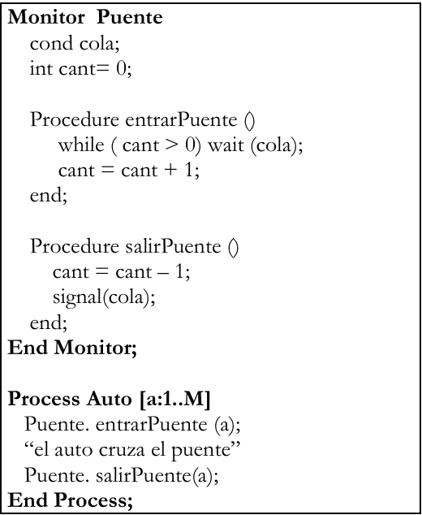

# Práctica 3

### 1)

Se dispone de un puente por el cual puede pasar un solo auto a la vez. Un auto pide permiso
para pasar por el puente, cruza por el mismo y luego sigue su camino.

a. ¿El código funciona correctamente? Justifique su respuesta.

b. ¿Se podría simplificar el programa? ¿Sin monitor? ¿Menos procedimientos? ¿Sin variable condition? En caso afirmativo, rescriba el código.

c. ¿La solución original respeta el orden de llegada de los vehículos? Si rescribió el código
en el punto b), ¿esa solución respeta el orden de llegada?



1. el código funciona correctamente, pasan de a un auto a la vez. 
    
    preguntar el paramentro a
    
2. Se puede simplificar ya que los monitores asegura la exclusion mutua, dado que los procesos de los mismos no se pueden ejecutar concurrentemente 

```java
Monitor Puente{

	Procedure cruzarPuente(){
	}
	
	}

Process Auto [a:1..M]{
		Puente.cruzarPuente();
}
```

c. La solucion a no respeta el orden de llegada, ya que si bien utiliza una cola, cuando se le hace un signal a un auto de la cola, otro puede haber llegado en ese momento y le gana en la carrera por cruzar al puente. 

La solucion b tampoco respeta el orden, ya que si hay varios queriendo ejecutar el llamado a entrarPuente() quien maneja dicho acceso sera el SO. 

### 2)

Existen N procesos que deben leer información de una base de datos, la cual es administrada
por un motor que admite una cantidad limitada de consultas simultáneas.
a) Analice el problema y defina qué procesos, recursos y monitores/sincronizaciones
serán necesarios/convenientes para resolverlo.
b) Implemente el acceso a la base por parte de los procesos, sabiendo que el motor de
base de datos puede atender a lo sumo 5 consultas de lectura simultáneas.

```java
Monitor Controlador{
int s=5; int espera=0;
cond pos;
	
		Procedure pedido_leer(){
					if(s==0){
							espera++; wait(pos);
					}
					else{
						s--;
					}
		}
		
		Procedure liberar_leer(){
				if(espera==0){
					s++;
				}
				else{
					espera--;
					signal(pos);
				}
		}		
}

Process lector (id:1..N){
		Controlador.pedido_leer();
		//lee la BD
		Controlador.liberar_leer();
}

```

no era necesario respetar orden

### 3)

Existen N personas que deben fotocopiar un documento. La fotocopiadora sólo puede ser
usada por una persona a la vez. Analice el problema y defina qué procesos, recursos y
monitores serán necesarios/convenientes, además de las posibles sincronizaciones requeridas
para resolver el problema. Luego, resuelva considerando las siguientes situaciones:

a) Implemente una solución suponiendo no importa el orden de uso. Existe una función
Fotocopiar() que simula el uso de la fotocopiadora.

```java
Monitor Fotocopiadora {

	
	Procedure usarFotocopiadora(){
		Fotocopiar();
	}
	

		
}

Process persona (id:1..N){

			Fotocopiadora.usarFotocopiadora();

}

```

b) Modifique la solución de (a) para el caso en que se deba respetar el orden de llegada.

```java
Monitor Fotocopiadora {

	int s=1;  cond pos; int espera=0;
	
	Procedure pedir_fotocopiadora(){
			If(s==0){
					espera++; wait(pos);
			}
			else{
			  s--;	
			}
	}
	
	Procedure liberar_fotocopiadora(){
			if(espera==0){
				s++;
			}
			else{
				espera--; signal(pos);
			}
	}
		
}

Process persona (id:1..N){

			Fotocopiadora.pedir_fotocopiadora();
			Fotocopiar();
			Fotocopiadora.liberar_fotocopiadora();

}

```

c) Modifique la solución de (b) para el caso en que se deba dar prioridad de acuerdo con la
edad de cada persona (cuando la fotocopiadora está libre la debe usar la persona de mayor
edad entre las que estén esperando para usarla).

```java
Monitor Fotocopiadora {

	boolean libre=true;
	cond turno[N];
	cola espera;
	
	Procedure pedir_fotocopiadora(int id, int edad){
			If(libre){
				libre=false;
			}
			else{
					insertarOrdenado(espera,id,edad);
					wait(turno[id]);
			}
	}
			
	}
	
	Procedure liberar_fotocopiadora(){
			if(empty(espera)){
					libre=true;
			}
			else{
					sacar(espera,id);
					signal(turno[id]);
			}
	}
		
}

Process persona (id:1..N){

			Fotocopiadora.pedir_fotocopiadora(id,edad);
			Fotocopiar();
			Fotocopiadora.liberar_fotocopiadora();

}

```

d) Modifique la solución de (a) para el caso en que se deba respetar estrictamente el orden
dado por el identificador del proceso (la persona X no puede usar la fotocopiadora hasta
que no haya terminado de usarla la persona X-1).

```java
Monitor Fotocopiadora {

	int actual=1;  cond orden[N];
	
	Procedure pedir_fotocopiadora(int id){
	
			if(id != actual){
					wait(orden[id]);
			}
			
	}
	
	Procedure liberar_fotocopiadora(){
			actual++;
			signal(orden[actual]);
		
	}
		
}

Process persona (id:1..N){

			Fotocopiadora.pedir_fotocopiadora(id);
			Fotocopiar();
			Fotocopiadora.liberar_fotocopiadora();

}
****
```

e) Modifique la solución de (b) para el caso en que además haya un Empleado que le indica
a cada persona cuando debe usar la fotocopiadora.

```java
Monitor Fotocopiadora {

	cond pos; int espera=0;  cond empleado;
	cond fin;
	
	Procedure pedir_fotocopiadora(){
			
					espera++;
					signal(empleado);
					wait(pos);
		
	}
	
	Procedure liberar_fotocopiadora(){
				signal(fin);
	}
	
	Procedure asignarPersona(){
			if(espera==0){
					wait(empleado);
			}
			espera--; signal(pos);
		  wait(fin);
}

Process persona (id:1..N){

			Fotocopiadora.pedir_fotocopiadora();
			Fotocopiar();
			Fotocopiadora.liberar_fotocopiadora();

}

Process Empleado {
			for i:1..N {
					Fotocopiadora.asignarPersona();
			}

}

```

consultar

f) Modificar la solución (e) para el caso en que sean 10 fotocopiadoras. El empleado le indica
a la persona cuál fotocopiadora usar y cuándo hacerlo.

```java
Monitor Fotocopiadora {

  cond impresora;
	cond fin;   cola impresorasLibres;
	Vector personaImpresora[N];
	Vector persona[N];
	cola colapersonas;

	
	Procedure pedir_fotocopiadora(int id, Impresora imp){
					colapersonas.push(id);
					signal(empleado);
					wait(persona[id]);
					imp = personaImpresora[id];
	}
	
	Procedure liberar_fotocopiadora(Impresora imp){
				impresorasLibres.push(imp);
				signal(impresora);
			
	}
	
	Procedure asignarPersona(){
			int id;
			if(colapersonas.empty()){
				wait(empleado);
			}
			id=colapersonas.pop();
			if(impresorasLibres.empty()){
					wait(impresora);
			}
			impresora = impresorasLibres.pop();
			personaImpresora[id]= impresora;
			signal(persona[id]);
			
			
}

Process persona (id:1..N){
			Fotocopiadora f;
			Impresora imp;
			
			Fotocopiadora.pedir_fotocopiadora(id,imp);
			imp.Fotocopiar();
			Fotocopiadora.liberar_fotocopiadora(imp);

}

Process Empleado {
			for i:1..N {
					Fotocopiadora.asignarPersona();
			}

}

```

### 4)

Existen N vehículos que deben pasar por un puente de acuerdo con el orden de llegada.
Considere que el puente no soporta más de 50000kg y que cada vehículo cuenta con su propio
peso (ningún vehículo supera el peso soportado por el puente).

```java
Monitor Puente {
  int MAX = 50000;
  int carga = 0;
  colaVehiculos cola;
  cond espera[N];

  Procedure pedirAcceso(int id, int peso) {
    
    cola.push(id);

 
    while (leerPrimeroEnCola(cola) != id || (carga + peso) > MAX) {
      wait(espera[id]);
    }

    cola.pop(); 
    carga += peso;              
  }

  Procedure salir(int id, int peso) {
    carga -= peso;
    if (!cola.isEmpty()) {
      int siguiente = leerPrimeroEnCola(cola);
      signal(espera[siguiente]);   
    }
  }
}

```

```java
process Vehiculo (id:0..N){

		Puente.pedirAcceso(id,peso)
		//pasar por el puente
		Puente.salir(id, peso);

}
```

### 5)

En un corralón de materiales se deben atender a N clientes de acuerdo con el orden de llegada.
Cuando un cliente es llamado para ser atendido, entrega una lista con los productos que
comprará, y espera a que alguno de los empleados le entregue el comprobante de la compra
realizada.
a) Resuelva considerando que el corralón tiene un único empleado.
b) Resuelva considerando que el corralón tiene E empleados (E > 1). Los empleados no
deben terminar su ejecución.
c) Modifique la solución (b) considerando que los empleados deben terminar su ejecución
cuando se hayan atendido todos los clientes.

```java
Monitor Corralon(){
		
  cola elibres; 
  cond esperaC;
  int esperando = 0, cantLibres = 0;
  
  Procedure llegada(){
      if (cantLibres == 0) {
              esperando ++;
              wait (esperaC);
       }
         else cantLibres--;    
      pop(elibre); 
   }
   
   
 Procedure Próximo() { 
       push(elibres);
        if (esperando > 0 )   { 
             esperando --;
             signal (esperaC); 
        }
          else cantLibres++;
       }   
	}
}

Monitor Escritorio {
  cond vcCliente, vcEmpleado;
  lista lista;
  text comprobante;
  boolean listo = false;
  
  Procedure atención(ListaProd: in lista; Comprobante: out text)
      { lista = ListaProd;
         listo = true; 
         signal (vcEmpleado);
         wait (vcCliente);
         Comprobante = comprobante;
         signal (vcEmpleado);   
      }
Procedure EsperarLista(listaProd : out Lista)
      {  if (not listo) wait (vcEmpleado);
          listaProd = lista;
      }   
 Procedure enviarComprobante(comp: in text)
	      { coprobante = comp;
          signal (vcCliente);
          wait (vcEmpleado);
          listo = false;
       }    

process Cliente (id:1..N){
		Lista listaProductos;
		text comprobante;
		Corralon.llegada();
		Escritorio.atencion(listaProductos,comprobante);
}

process Empleado(){
	for (i:1..N){
				Corralon.proximo();
				Escritorio.esperarLista(lista);
				comprobante = //genera el comprobante
				Escritorio.enviarComprobante(comprobante);
	}

}
```

b) Resuelva considerando que el corralón tiene E empleados (E > 1). Los empleados no
deben terminar su ejecución.

```java
Monitor Corralon{
		
  cola elibres; 
  cond esperaC;
  int esperando = 0, cantLibres = 0;
  
  Procedure llegada(idE: out int){
      if (cantLibres == 0) {
              esperando ++;
              wait (esperaC);
       }
         else cantLibres--;    
      pop(elibres, idE); 
   }
   
   
 Procedure Próximo(idE: in int)  { 
       push(elibres, idE);
        if (esperando > 0 )   { 
             esperando --;
             signal (esperaC); 
        }
          else cantLibres++;
       }   
	}
}

Monitor Escritorio [id:1..E] {
  cond vcCliente, vcEmpleado;
  lista lista;
  text comprobante;
  boolean listo = false;
  
  Procedure atención(ListaProd: in lista; Comprobante: out text)
      { lista = ListaProd;
         listo = true; 
         signal (vcEmpleado);
         wait (vcCliente);
         Comprobante = comprobante;
         signal (vcEmpleado);   
      }
Procedure EsperarLista(listaProd : out Lista)
      {  if (not listo) wait (vcEmpleado);
          listaProd = lista;
      }   
 Procedure enviarComprobante(comp: in text)
	      { coprobante = comp;
          signal (vcCliente);
          wait (vcEmpleado);
          listo = false;
       }    

process Cliente (id:1..N){
		Lista listaProductos;
		int idE;
		text comprobante;
		Corralon.llegada(idE);
		Escritorio[idE].atencion(listaProductos,comprobante);
}

process Empleado(id:1..N){
	while(true){
				Corralon.proximo(id);
				Escritorio[id].esperarLista(lista);
				comprobante = //genera el comprobante
				Escritorio[id].enviarComprobante(comprobante);
	}

}
```

c) Modifique la solución (b) considerando que los empleados deben terminar su ejecución
cuando se hayan atendido todos los clientes.

```java
Monitor Corralon{
		
  cola elibres; 
  cond esperaC;
  int esperando = 0, cantLibres = 0;
  int cant=0;
  boolean fin=false;
  
  Procedure llegada(idE: out int){
      if (cantLibres == 0) {
              esperando ++;
              wait (esperaC);
       }
         else cantLibres--;    
      pop(elibres, idE);
      cant++; 
   }
   
   
 Procedure Próximo(idE: in int, fin: out boolean)  {
			 if(cant = N){
					 fin=true;
			 }
			 else{
	       push(elibres, idE);
	        if (esperando > 0 ){ 
	             esperando --;
	             signal (esperaC); 
	        }
	         {else cantLibres++;}
	        
	      }
	          
	}
}

Monitor Escritorio [id:1..E] {
  cond vcCliente, vcEmpleado;
  lista lista;
  text comprobante;
  boolean listo = false;
  
  Procedure atención(ListaProd: in lista; Comprobante: out text)
      { lista = ListaProd;
         listo = true; 
         signal (vcEmpleado);
         wait (vcCliente);
         Comprobante = comprobante;
         signal (vcEmpleado);   
      }
Procedure EsperarLista(listaProd : out Lista)
      {  if (not listo) wait (vcEmpleado);
          listaProd = lista;
      }   
 Procedure enviarComprobante(comp: in text)
	      { coprobante = comp;
          signal (vcCliente);
          wait (vcEmpleado);
          listo = false;
       }    
}

process Cliente (id:1..N){
		Lista listaProductos;
		int idE;
		text comprobante;
		Corralon.llegada(idE);
		Escritorio[idE].atencion(listaProductos,comprobante);
}

process Empleado(id:1..N){
	boolean fin=false;
	while(not fin){
				Corralon.proximo(id,fin);
				if(not fin){
					Escritorio[id].esperarLista(lista);
					comprobante = //genera el comprobante
					Escritorio[id].enviarComprobante(comprobante);
				}

	}

}
```

Falta acomodar este por el siguiente problema:

varios empleados libres esperando y como la persona solo despiertta a uno, los demas se quedan esperando en esperar lista y ocurre inanicion

### 6)

Existe una comisión de 50 alumnos que deben realizar tareas de a pares, las cuales son
corregidas por un JTP. Cuando los alumnos llegan, forman una fila. Una vez que están todos
en fila, el JTP les asigna un número de grupo a cada uno. Para ello, suponga que existe una
función AsignarNroGrupo() que retorna un número “aleatorio” del 1 al 25. Cuando un alumno ha recibido su número de grupo, comienza a realizar su tarea. Al terminarla, el alumno le avisa
al JTP y espera por su nota. Cuando los dos alumnos del grupo completaron la tarea, el JTP
les asigna un puntaje (el primer grupo en terminar tendrá como nota 25, el segundo 24, y así
sucesivamente hasta el último que tendrá nota 1). Nota: el JTP no guarda el número de grupo
que le asigna a cada alumno.

```java

Monitor Tareas {

		int cant=0;
		cond espera;
		cond listo;
		colaAlumnos cola;
		colaFinalizados finalizados;
		vector grupos[50]=([50]0);
		cond esperaAlumno[50];
		vector notas[25];
		cond terminamos;
		int notaActual=25;
		cond grupoNota[25];
		vector gruposFinalizados[25] = ([25]0);

		Procedure llegada(id: in int){
				cant++;
				cola.push(id);
				if(cant == 50){
						signal(listo);
				}
		}
		
		
		Procedure esperarAlumnos(){
				if(cant < 50){
					wait(listo);
				}
		}
		
		Procedure esperarNumeroGrupo(nro: out int, id: in int){
		
					if(grupos[id] == 0){
							wait(esperaAlumno[id]);
					}
					nro = grupos[id];
		}
		
		Procedure asignarGrupo(){
				cola.pop(id);
				grupos[id]=AsignarNroGrupo();
				signal(esperaAlumno[id]);
		}
		
		
		Procedure avisoFin(grupo: in int, nota: out int){
		
				gruposFinalizados[grupo]+=1;
				if(gruposFinalizados[grupo]==2){
						finalizados.push(grupo);
						signal(terminamos);
				}
				wait(grupoNota[grupo]);
				nota = notas[grupo];
		}
		
		Procedure esperarFin(){
					int grupo;
					if(finalizados.isEmpty())
						wait(terminamos);
					grupo= finalizados.pop();
					notas[grupo]= notaActual;
					signal_all(grupoNota[grupo]);
					notaActual--;
		}
}

process Alumno (id:1..50){

		int nro,nota;
		Tareas.llegada(id);
		Tareas.esperarNumeroGrupo(nro,id);
		//realiza la tarea
		Tareas.avisoFin(nro,nota);
		
}

process JTP(){

		Tareas.esperarAlumnos();
		for (i:1..50){
				Tareas.asignarGrupo();
		}
		for (1..25){
			Tareas.esperarFin();
		}
}
```

### 7)

Se debe simular una maratón con C corredores donde en la llegada hay UNA máquina
expendedoras de agua con capacidad para 20 botellas. Además, existe un repositor encargado
de reponer las botellas de la máquina. Cuando los C corredores han llegado al inicio comienza
la carrera. Cuando un corredor termina la carrera se dirigen a la máquina expendedora, espera
su turno (respetando el orden de llegada), saca una botella y se retira. Si encuentra la máquina
sin botellas, le avisa al repositor para que cargue nuevamente la máquina con 20 botellas;
espera a que se haga la recarga; saca una botella y se retira. Nota: mientras se reponen las
botellas se debe permitir que otros corredores se encolen.

```java
Monitor Maraton {

		cond espera_inicio;
		cant=0;
		boolean false;
		cond esperaMaquina;
		int espera=0;

		Procedure inicio(){
				cant++;
				if(cant < C){
						wait(espera_inicio);
				}
				else{
					signal_all(espera_inicio);
				}
		}
		
		Procedure accederMaquina(){
				if(!libre){
						wait(esperaMaquina);
						espera++;
				}
				else{
					libre=false;
				}
		
		}
		
		Procedure liberarMaquina(){
				if(espera == 0){
					libre=true;
				}
				else{
						espera--;
						signal(esperaMaquina);
				}
		}

}

Monitor MaquinaExpendedora {
		int botellasDisp = 20;
		colaCorredores cola;
		cond reponer;
		cond esperaBotella;
		
		Procedure agarrarBotella(){
				if(botellasDisp==0){
						signal(reponer);
						wait(botella);
				}
				botellasDisp--;		
		}
		
	  Procedure esperarAviso(){
			  if(botellasDisp > 0){
						  wait(reponer);
				}
		}
		
		Procedure avisarContinue(){
				botellaDispo=20;
				signal(botella);
	  }

}

process Corredor (id:1..C){
		Maraton.inicio();
		//corriendo carrera
		Maraton.accederMaquina();
		MaquinaExpendedora.agarrarBotella();
		Maraton.liberarMaquina();
		//se retira
}

process Repositor(){

	while(true){
		MaquinaExpendedora.esperaAviso();
		//va a buscar las botellas
		MaquinaExpendedora.avisarContinue();
	
	
	}
}
```

### 8)

En un entrenamiento de fútbol hay 20 jugadores que forman 4 equipos (cada jugador conoce
el equipo al cual pertenece llamando a la función DarEquipo()). Cuando un equipo está listo
(han llegado los 5 jugadores que lo componen), debe enfrentarse a otro equipo que también
esté listo (los dos primeros equipos en juntarse juegan en la cancha 1, y los otros dos equipos
juegan en la cancha 2). Una vez que el equipo conoce la cancha en la que juega, sus jugadores
se dirigen a ella. Cuando los 10 jugadores del partido llegaron a la cancha comienza el partido,
juegan durante 50 minutos, y al terminar todos los jugadores del partido se retiran (no es
necesario que se esperen para salir).

```java

Monitor Cancha[id: 1..2]{

			int cant=0;
			cond inicio;

			Procedure llegada(){
					cant++;
					if(cant == 2){
						signal(inicio);
					}
					wait(completar);
			}
			
			Procedure jugar(){
					if(cant < 2){
							wait(inicio);
					}
			}
			
			Procedure terminar(){
					signal_all(completar);
			}

}

Monitor MonitorEquipo [id:1..4]{
			
			int cant;	
			cond listo,fin;

			Procedure llegada(){
					cant++;
					if(cant == 5){
						signal(listo);
					}
					wait(fin);	
			}
			
			procedure esperarAviso(cancha: out Cancha){
						wait(listo);
						CoordinadorCancha.obtenerCancha(cancha);
			}
			
			procedure retirarse(){
					signal_all(fin);
			}

}

Monitor CoordinadorCanchas {
	
		int canchaActual=0; 

		Procedure obtenerCancha(cancha: out int){
				canchaActual++;
				if(canchaActual == 1 || canchaActual==2){
					cancha=1;
				}
				else{
					cancha=2;
				}
		}

}
process Jugador(id:1..20){
		int equipo= DarEquipo();	
		MonitorEquipo[equipo].llegada();
		
}

process Equipo (id:1..4){
			int cancha;
			MonitorEquipo[id].esperarAviso(cancha);
			Cancha[cancha].llegada();
			Cancha[id].retirarse();
}

process Partido (id:1..2){

		Cancha[id].jugar();
		delay(50 minutos);
		Cancha[id].terminar();
		
}
```

### 9)

En un examen de la secundaria hay un preceptor y una profesora que deben tomar un examen
escrito a 45 alumnos. El preceptor se encarga de darle el enunciado del examen a los alumnos
cundo los 45 han llegado (es el mismo enunciado para todos). La profesora se encarga de ir
corrigiendo los exámenes de acuerdo con el orden en que los alumnos van entregando. Cada
alumno al llegar espera a que le den el enunciado, resuelve el examen, y al terminar lo deja
para que la profesora lo corrija y le envíe la nota. Nota: maximizar la concurrencia; todos los
procesos deben terminar su ejecución; suponga que la profesora tiene una función
corregirExamen que recibe un examen y devuelve un entero con la nota.

```java
Monitor Espera {

		int cant=0;
		cond preceptor,entregue;
		cola entrega;
		cond nota[45];
		VectorNotas notaAlumno[45];

		Procedure avisarLlegada(){
					cant++;
					if(cant==45){
							signal(preceptor);
					}	
		}
		
		Procedure esperaAlumnos(){
					if(cant<45){
							wait(preceptor);
					}
		}
		
		Procedure nota(nota: out int, id: in int){
					entrega.push();
					signal(entregue);
					wait(nota[id]);
					nota= notaAlumno[id];
		}
		
		Procedure entregarNota(){
				if(entrega.isEmpty()){
						wait(entregue);
				}
				entrega.pop(id,examen);
				notaAlumno[id]=corregirExamen(examen);
				signal(nota[id]);
		}

}

Monitor Examen [id:1..45]{
		
		cond enunciado;
		text enunciadoGeneral;
			
		Procedure esperarEnunciado(miEnunciado: out text){
						wait(enunciado);
						miEnunciado=enunciadoGeneral;
		}
		
		Procedure entregarEnunciado(e : in text){
					
					enunciadoGeneral=e;
					signal(enunciado);
		
		}

}

process Alumno(id:1..45){
		int nota;
		Espera.avisarLlegada();
		Examen[id].esperarEnunciado();
		//realizar examen
		Esperar.nota(nota);
		
}

process Preceptor(){
		Enunciado e; //armado del enunciado
		Espera.esperaAlumnos();
		for (i:1..45){
				Examen[i].entregarEnunciado(e);
		}	
}

process Profesora(){
		for (i:1..45){
				Esperar.entregarNota();
		}
}
```

### 10)

En un parque hay un juego para ser usada por N personas de a una a la vez y de acuerdo al
orden en que llegan para solicitar su uso. Además, hay un empleado encargado de desinfectar el
juego durante 10 minutos antes de que una persona lo use. Cada persona al llegar espera hasta
que el empleado le avisa que puede usar el juego, lo usa por un tiempo y luego lo devuelve.
Nota: suponga que la persona tiene una función Usar_juego que simula el uso del juego; y el
empleado una función Desinfectar_Juego que simula su trabajo. Todos los procesos deben
terminar su ejecución.

```java

Monitor Juego {

		int esperando=0;
		boolean libre = false;
		boolean limpiarJuego =true;
		cond limpiar,espera;

		Procedure llegue(){
		
				if(!libre){
						esperando++;
						wait(espera);
				}
				else 
					libre=false;

		}
		
		Procedure desinfectar(){
				if(!limpiarJuego){
						wait(limpiar);
				}
				DesinfectarJuego();
				if(esperando > 0)
						esperando--;
						signal(espera);
				}
				else{
						libre = true;
				}
		}
		
		Procedure liberar(){
				signal(limpiar);
		}
		

}

process Persona (id:1..N){

		Juego.llegue();
		Usar_juego();
		Juego.liberar();
}

process Empleado(){

		for i:1..N{
				Juego.desinfectar();
		}

}

```